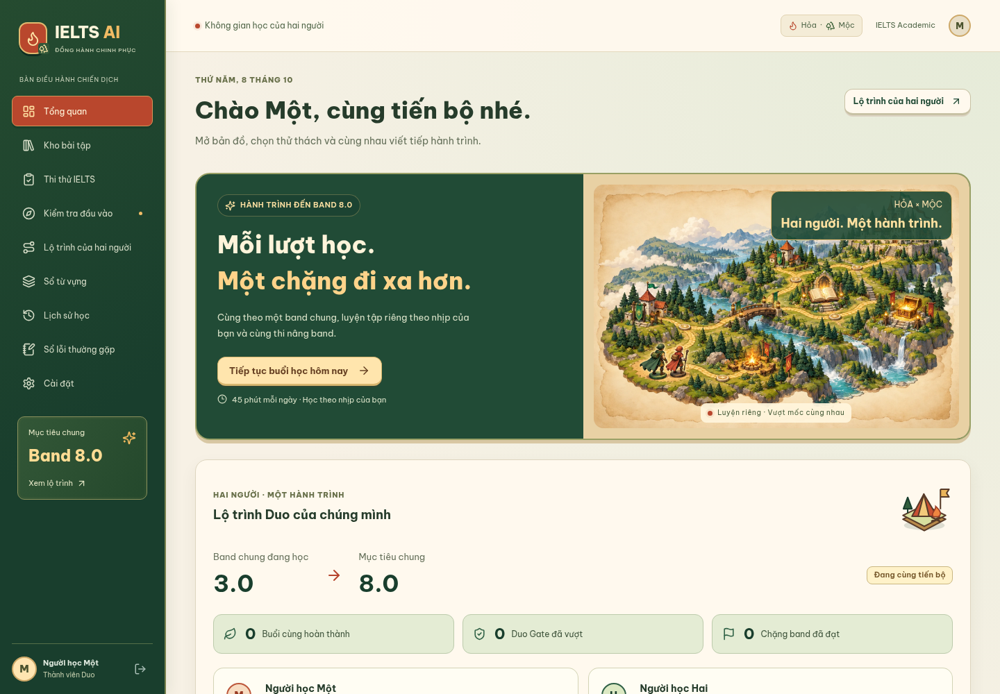
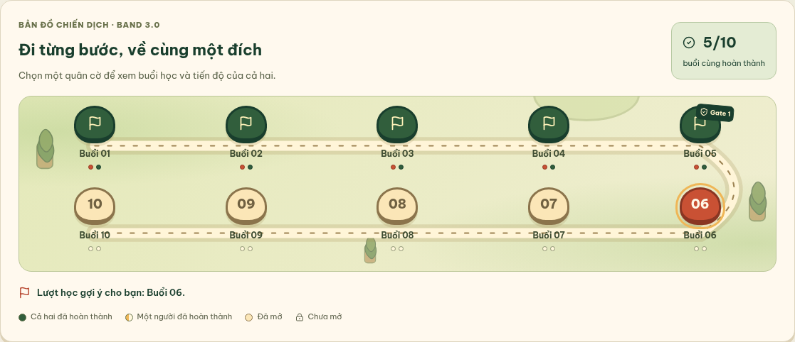
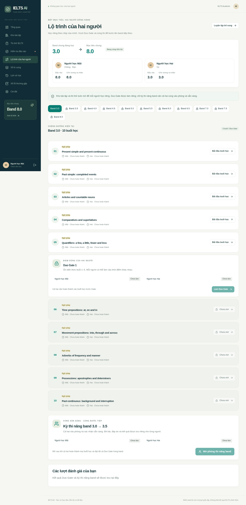
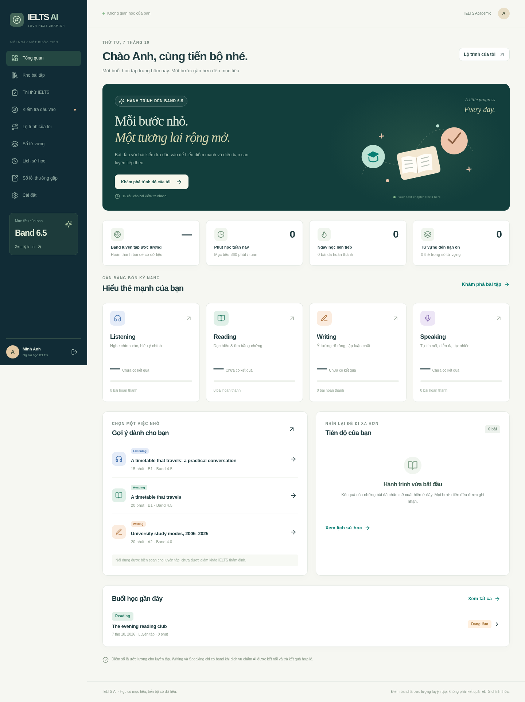

# Giao diện website

Ảnh chụp React website chạy với Node.js và MongoDB thực trong các lượt kiểm tra trình duyệt. HTTPS công khai của `https://sutonghanyu.vn` đã xác nhận bản Duo và ngân hàng band 8.0; giao diện chiến dịch dưới đây cần chạy updater riêng để xuất hiện trên VPS.

## Chiến dịch Hỏa + Mộc

Minh họa hoạt hình, bản đồ quân cờ, các cổng thử thách và huy hiệu dùng tiến độ thật của hai người. Font Be Vietnam Pro được phục vụ cùng website. Các ảnh dùng tài khoản tổng hợp; bản đồ minh họa trạng thái sau khi cả hai hoàn thành năm buổi và đạt Gate đầu tiên trong cấu hình kiểm thử 10 buổi/band.

| Màn hình | Ảnh |
| --- | --- |
| Tổng quan desktop | [Dashboard](screenshots/campaign-desktop-dashboard-viewport.png) |
| Thư viện desktop | [Kho bài tập](screenshots/campaign-desktop-library-viewport.png) |
| Thư viện mobile | [Font tiếng Việt trên điện thoại](screenshots/campaign-mobile-library-viewport.png) |
| Bản đồ và lượt tiếp theo | [Bản đồ chiến dịch](screenshots/campaign-desktop-plan-first-gate-board.png) |
| Huy hiệu mobile | [Các mốc đã mở và còn khóa](screenshots/campaign-mobile-plan-first-gate-rewards.png) |

Các ảnh phần dưới là bản giao diện trước, được giữ làm tài liệu lịch sử.

## Lộ trình Duo đến band 8.0

Đăng nhập bằng số điện thoại, điểm cá nhân tách riêng, band chung lấy mức thấp hơn và Gate mở khi cả hai pass. Kho bài và thi thường truy cập riêng; kỳ thi nâng band cần cả hai cùng vào phòng và Ready. Các ảnh dưới dùng tài khoản kiểm thử và cấu hình 10 buổi/band; cấu hình mặc định là 20 buổi, Gate mỗi 5 buổi.

[Máy tính](screenshots/duo-desktop-plan.png) · [Điện thoại](screenshots/duo-mobile-plan.png)

| Màn hình                            | Ảnh                                          |
| ----------------------------------- | -------------------------------------------- |
| Tổng quan trên máy tính             | [Desktop](screenshots/dashboard-desktop.png) |
| Tổng quan trên điện thoại           | [Mobile](screenshots/dashboard-mobile.png)   |
| Kho bài tập                         | [Thư viện](screenshots/library.png)          |
| Academic Writing Task 1 với biểu đồ | [Writing](screenshots/writing.png)           |
| Speaking với bản ghi WAV            | [Speaking](screenshots/speaking.png)         |

Chạy bản tương tác theo [README](../README.md). Danh sách kiểm tra và giới hạn dịch vụ live ở [validation.md](validation.md).
